# Learning Representative Points using Normalizing Flows

## TODO List
- COCO dataloader for points sampling from object segmentation mask.
- COCO dataloader for points sampling from object boundary.
- Implement semantic segmentation using NFs
 - Person segmentation (Simple binary segmentation of person vs background, N = 2)
 - Apply random cropping, jittering
 - Multi-class segmentation (N > 2)
- Implment boundary detection using NFs
 - Learn `circles` distribution by adding extra NF and use it as a prior flow.
 - Sample from learned prior flow and feed it to subsequent NF.
- Improve backbones
 - Use dilated convolutions
 - Use leaky ReLU
- Use Flow++, SoftFlow, Gradient Boosted NF instead of CNFs.
- Vary the number of sample points
 - Currently, 150 points
  - 4 -> 15 -> 30 -> 60
- Implement hard negative mining scheme (or do we actually need it?)

## Test Results
Sampled from truncated normals (stddev=0.2)

### Epoch-18
Now able to cover multiple instances

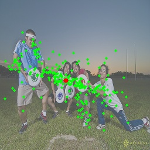

### Epoch-16
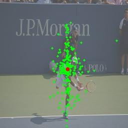
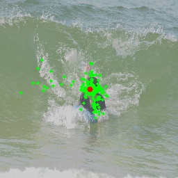
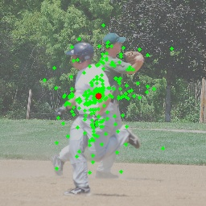
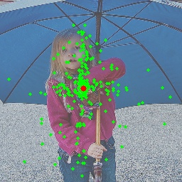
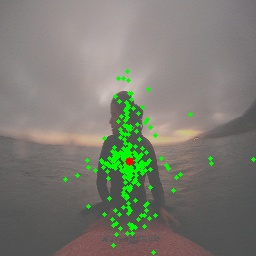
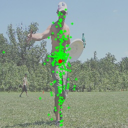
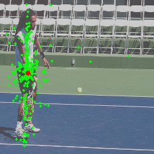
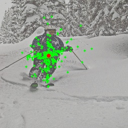
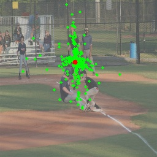
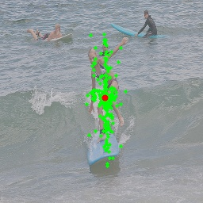

## Obervations
At the early stage of training, the model focuses on covering a single person.
Then, the Normalizing Flow is tring to learn harder cases where multimodality
is present in a single image
so that points could be sampled to cover multiple instances.

 ## Maintainers
 - Sae Young Kim
